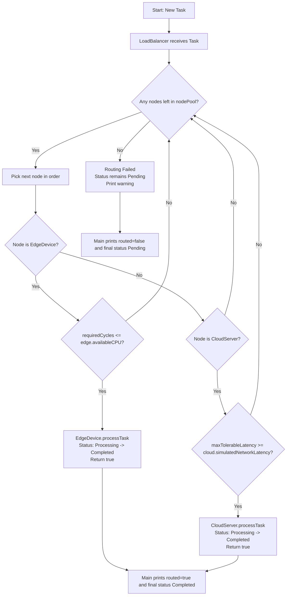

# ODP Project - Edge and Cloud Task Routing Simulator

This is a simple C++ Object-Oriented Programming project that simulates how tasks are routed between edge devices and a cloud server.

The goal is to show how a load balancer can choose an appropriate compute node based on task requirements like:
- CPU cycles needed
- maximum tolerable network latency

## Project Idea

In real systems, small and urgent tasks are often handled at the edge (low latency), while heavier tasks can be sent to the cloud.

This project models that behavior using OOP concepts:
- abstraction
- inheritance
- polymorphism
- encapsulation

## Main Components

- `Task`
	- Represents a unit of work.
	- Stores task ID, required CPU cycles, max tolerable latency, and status (`Pending`, `Processing`, `Completed`).

- `ComputeNode` (abstract base class)
	- Common interface for all compute resources.
	- Declares `canProcess()` and `processTask()`.

- `EdgeDevice` (derived class)
	- Simulates a nearby low-latency edge node.
	- Accepts tasks only if required cycles are within its available CPU.

- `CloudServer` (derived class)
	- Simulates a cloud node with higher network latency.
	- Accepts tasks if task latency tolerance is high enough.

- `LoadBalancer`
	- Stores available nodes.
	- Routes each task to the first node that can process it.

## How Routing Works

For each task:
1. `LoadBalancer` checks nodes in order.
2. It calls each node's `canProcess(task)`.
3. The first matching node runs `processTask(task)`.
4. If no node can process it, a warning is shown.

## Routing Flowchart



## Files

- `main.cpp` - creates nodes, creates sample tasks, and runs the simulation.
- `Task.h/.cpp` - task model and status management.
- `ComputeNode.h` - abstract compute node interface.
- `EdgeDevice.h/.cpp` - edge node behavior.
- `CloudServer.h/.cpp` - cloud node behavior.
- `LoadBalancer.h/.cpp` - task routing logic.

## Build and Run

### Using g++ (same as VS Code task)

```bash
g++ -std=c++17 -g *.cpp -o edge_sim
./edge_sim
```

On Windows CMD/PowerShell:

```powershell
g++ -std=c++17 -g *.cpp -o edge_sim
.\edge_sim
```

## Sample Behavior

- Very small/urgent tasks are routed to `EdgeDevice`.
- Heavy tasks with relaxed latency are routed to `CloudServer`.
- Tasks that fit neither condition are rejected with a warning.

## Learning Outcomes

This project demonstrates:
- class design in C++
- virtual functions and runtime polymorphism
- clean separation of responsibilities across classes
- basic scheduling/routing simulation logic